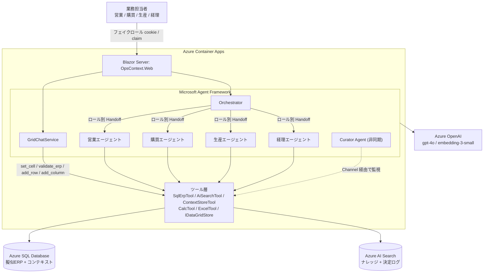
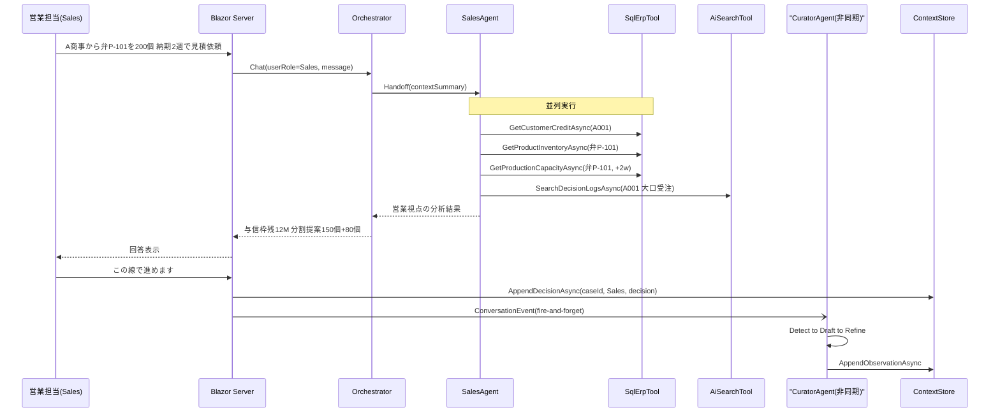
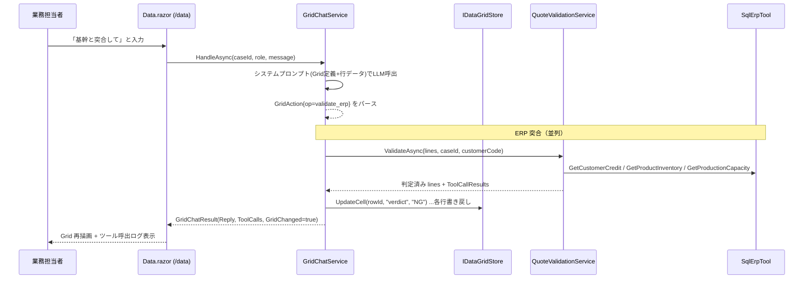
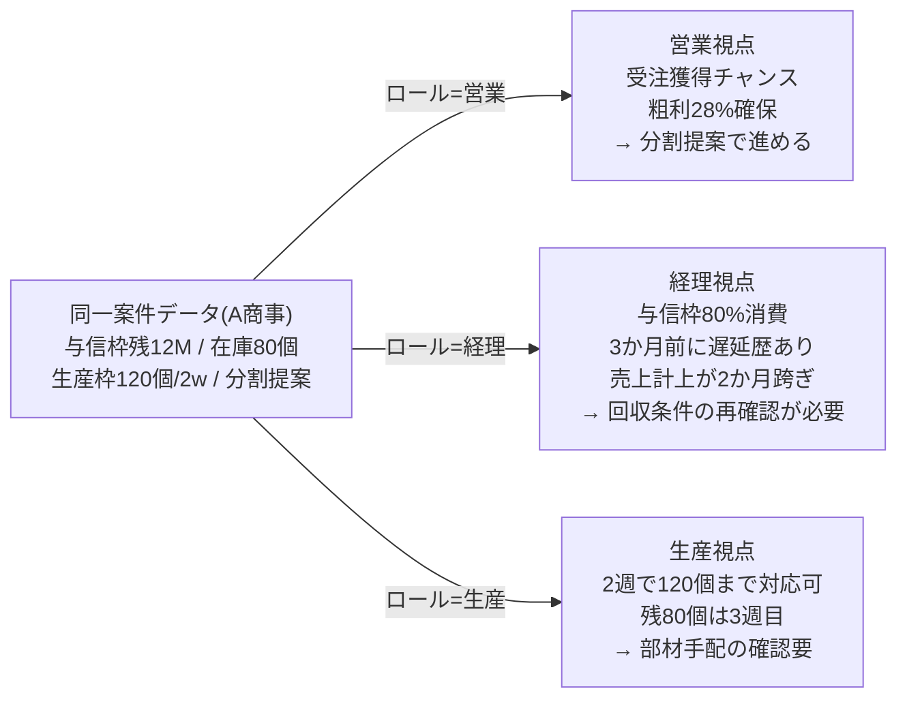
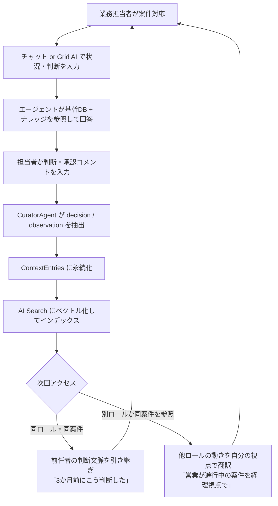
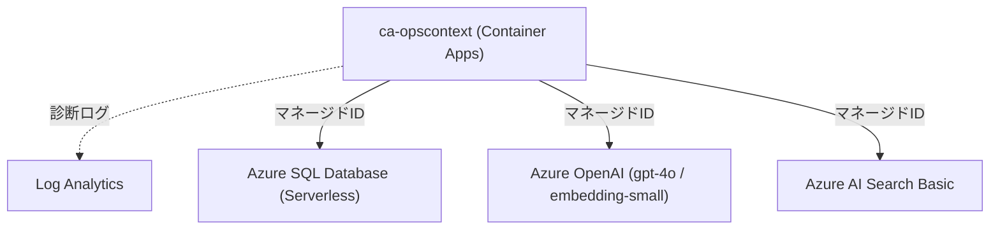

# OpsContext — Microsoft Agent Hackathon 2026 実装計画

## Context

Microsoft Agent Hackathon 2026 への応募作品。締切 **2026-06-01 23:59**、残り約2日。ユーザーは ERP（GRANDIT / SQL Server）SIer 所属で、社内AI導入リーダー。Curia（同ユーザー作の WPF デスクトップアプリ／プロジェクトコンテキストキュレーター）の資産を流用しつつ、ハッカソンのパートナーベンダー部門に提出する Web アプリを構築する。

WPF はそのまま提出できない（審査員アクセス不可）ため、Curia の **「コンテキスト育成 × ロール別エージェント × 横断クエリ」哲学のみ Web 化**。題材は「業務担当者ロールごとに AI の判断・翻訳が変わる、業務オペレーション・コンテキスト・コパイロット」。デモは大口受注の横断意思決定 1 シナリオに集中、コンセプトは汎用基盤として広めに語る。

## プロダクト定義

**OpsContext** — ERP データを Grid で管理し、AI エージェントと協働して業務判断をコンテキストに記録するプラットフォーム。

- ユーザーがロールでログイン（営業／購買／生産／経理） → エージェントの語り口・フォーカスが切替
- 業務データを Grid（Excel 協働編集的）で管理し、AI とのチャットでセル読み書き・ERP 突合・列追加を指示できる
- 基幹（擬似ERP = Azure SQL Database）と AI Search（ナレッジ＋過去決定ログ）を横断
- 作業中の判断・コメントを **Curator Agent** が裏で抽出して蓄積（Curia の `DecisionLogGeneratorService` / `FocusUpdateService` 哲学）
- 次の担当者（別ロール含む）には、過去の文脈がそのロール視点に翻訳されて再構成

## アーキテクチャ



**協調パターン**: Handoff（主）+ Sequential（Tool 直列）+ Parallel（SQL 3 本同時）。GroupChat 不採用。

### エージェント協調シーケンス（メインデモシナリオ）



### Grid × AI 協働シーケンス（業務データ画面）



### ロール翻訳フロー



### コンテキスト蓄積ループ



### Azure インフラ構成



全リソースは `rg-opscontext (japaneast)` 配下。接続はマネージドIDをプライマリとし、詰まった場合は接続文字列 / API キーにフォールバック（[[09-deploy]] 参照）。

## エージェント設計

| Agent | 主に使う Tool | フォーカス |
|---|---|---|
| Orchestrator | HandoffToRoleAgent / HandoffToCrossRoleView | ロール claim で語り口とフォーカスを切替 |
| Sales | SqlErp(Credit, SimilarOrders), AiSearch(Knowledge), ContextStore | 受注獲得・粗利・顧客関係 |
| Purchasing | SqlErp(Inventory, SimilarOrders), AiSearch | 仕入リスク・代替調達 |
| Production | SqlErp(Capacity, Inventory), AiSearch | 生産枠・スケジュール |
| Accounting | SqlErp(Credit, ReadOnlyQuery), AiSearch(DecisionLog), Calc | 与信・回収・売上計上影響 |
| Curator（裏方） | ContextStore(Append*), AiSearch upsert | 会話から決定/観察を抽出して蓄積 |
| GridChatService | IDataGridStore, QuoteValidationService, SqlErpTool, ContextStore | Grid への AI 協働編集・ERP 突合・コンテキスト記録 |

**GridChatService アクション仕様**:
- `set_cell` — 指定セルをAIが更新（単価補完・判定記入等）
- `add_row` — 新規行追加（初期値付き）
- `add_column` — 新規列追加（型: Text / Number / Date）
- `validate_erp` — Grid行を QuoteValidationService で ERP 突合し判定/リスク/推奨を書き戻す
- `none` — Grid 変更なし（会話のみ）

LLM はアクション JSON を返し、コード側が適用する（「数値判断はコード、文章はLLM」方針を GridChatService でも継承）。

**Orchestrator 翻訳プロンプト骨子**:
```
ユーザーロール: {role}
ロール別フォーカス: Sales=受注獲得 / Purchasing=仕入リスク / Production=生産枠 / Accounting=与信回収
他ロール案件を見るときは {role} 観点で翻訳し、翻訳理由を1文添える。
```

**Curator 実装**: `IHostedService` + `Channel<ConversationEvent>` fire-and-forget。3–5 ターンに1回、Curia の Detect→Draft→Refine 3 段プロンプトをそのまま移植。

## Tool 層シグネチャ

```csharp
public interface ISqlErpTool {
    Task<SqlQueryResult> GetCustomerCreditAsync(string customerCode, CancellationToken ct);
    Task<SqlQueryResult> GetProductInventoryAsync(string productCode, CancellationToken ct);
    Task<SqlQueryResult> GetProductionCapacityAsync(string productCode, DateOnly from, DateOnly to, CancellationToken ct);
    Task<SqlQueryResult> SearchSimilarOrdersAsync(string customerCode, string productCode, int topN, CancellationToken ct);
    Task<SqlQueryResult> RunReadOnlyQueryAsync(string sql, CancellationToken ct); // SELECT-only + table whitelist
}
public interface IAiSearchTool {
    Task<IReadOnlyList<AiSearchHit>> SearchKnowledgeAsync(string query, int topK, string? roleFilter, CancellationToken ct);
    Task<IReadOnlyList<AiSearchHit>> SearchDecisionLogsAsync(string query, string? customerCode, int topK, CancellationToken ct);
    Task<string> UpsertContextEntryAsync(string entryId, string caseId, string role, string kind, string customerCode, string text, CancellationToken ct);
}
public interface IContextStoreTool {
    Task<IReadOnlyList<ContextEntry>> ReadCaseContextAsync(string caseId, string? roleViewpoint, CancellationToken ct);
    Task<string> AppendDecisionAsync(string caseId, string role, string author, string text, CancellationToken ct);
    Task<string> AppendObservationAsync(string caseId, string role, string author, string text, CancellationToken ct);
}
public interface ICalcTool {
    decimal CreditAvailable(decimal limit, decimal used, decimal pendingOrderAmount);
    decimal GrossMarginRatio(decimal price, decimal cost);
}
// -- Grid ストア --
public interface IDataGridStore {
    GridTable GetActiveTable();
    Task SeedSampleAsync(CancellationToken ct = default);
    void Reset();
    void UpdateCell(string rowId, string columnKey, object? value);
    string AddRow(Dictionary<string, object?>? initialCells = null);
    void DeleteRow(string rowId);
    void AddColumn(GridColumn column);
    void ReplaceTable(GridTable table);
}
// GridTable: Id, Name, List<GridColumn>, List<GridRow>
// GridColumn: Key, Label, GridColumnType(Text/Number/Date)
// GridRow: RowId, Dictionary<string, object?> Cells
// -- Excel 取込/エクスポート --
public interface IExcelTool {
    IReadOnlyList<QuoteLine> ParseQuoteLines(Stream xlsx);
    byte[] ExportWithVerdicts(IReadOnlyList<QuoteLine> lines);
}
// QuoteLine: ProductCode, ProductName, Qty, RequestedDate, UnitPrice
//          + Verdict(OK/Warning/NG), RiskLevel, Recommendation, RefNote
// ExcelTool 実装: ClosedXML (MIT)。EPPlus は商用ライセンスのため不採用。
// QuoteValidationService.ValidateAsync: distinct 製品/顧客で SqlErpTool を並列実行し、
//   ICalcTool で判定確定、推奨文のみ LLM 生成（数値判断を LLM に委ねない）。
//   GridChatService.validate_erp から呼び出し、結果を IDataGridStore に書き戻す。
```

LLM が生成した SQL は **SELECT のみホワイトリスト**。決定的計算は LLM に渡さず Calc Tool で処理。

## SQL スキーマ

### 擬似ERP（基幹）
- `Customers` (CustomerCode PK, Name, Industry, CreditLimit, CreditRating, PaymentTermDays, SalesRep)
- `Products` (ProductCode PK, Name, Category, UnitPrice, UnitCost, LeadTimeDays)
- `Orders` (OrderId, OrderNo, CustomerCode, OrderDate, RequestedDeliveryDate, Status, TotalAmount, SalesRep)
- `OrderLines` (OrderLineId, OrderId, ProductCode, Quantity, UnitPrice, LineAmount)
- `Inventory` (ProductCode PK, OnHandQty, AllocatedQty, SafetyStock, LastUpdated)
- `ProductionCapacity` (ProductCode + CapacityDate PK, AvailableUnits, ReservedUnits)
- `CreditHistory` (Id, CustomerCode, OccurredAt, EventType, Note)

### コンテキストストア
- `Cases` (CaseId GUID PK, Title, CustomerCode, Status, CreatedAt, UpdatedAt)
- `ContextEntries` (EntryId, CaseId FK, Role, Author, Kind=[decision/observation/question/answer/handoff], Text, RefSql, CreatedAt, EmbeddingId)
- `FocusSnapshots` (SnapshotId, CaseId, Role, SummaryMd, CreatedAt) — Curia の current_focus.md 相当

### サンプルデータ
- 顧客10／製品20／受注60／生産能力90日／与信履歴3
- 主役: **A商事(A001)** = 与信枠50M／使用38M／残12M、**弁P-101** = 単価8万／リードタイム30日／在庫80／安全在庫50
- これで「200個受注 = 与信オーバー + 生産枠不足」が成立
- Grid のシードデータ: 弁P-101 / P-202 / P-303 の 3 行（見積明細テーブル）

## コンテキスト永続化方針

- 正規: **SQL の `ContextEntries` / `FocusSnapshots`**
- 検索用: **AI Search にミラー**（embedding-3-small で `contentVector`）。インデックス `opscontext-context` と `opscontext-knowledge` の 2 本
- Grid データ: **インメモリ（IDataGridStore）**。取込事実・AI 操作ログのみ ContextEntries に observation 記録

## 認証

- **本番想定**: Entra ID + App Roles (`Sales/Purchasing/Production/Accounting`) → `ClaimsPrincipal.IsInRole()`
- **MVP（採用）**: Cookie 認証 (`AddCookie`) + `IUserStore` パターン。ログイン画面 (`/login`) + POST `/auth/login` / `/auth/logout` エンドポイント。モック時は `MockUserStore`（固定ユーザー）、本番時は `SqlUserStore`（Users テーブル）で差替可能。ロールは Cookie クレーム (`ClaimTypes.Role`) 経由で `RoleStateService` に反映。
- Entra ID 移行は `AddCookie` を `AddMicrosoftIdentityWebApp` に差し替えるだけで済む抽象化になっている。
- 記事で「Entra ID 前提に設計、デモは UserStore で逃げている」と正直に書く

## 画面構成（確定）

| パス | 画面 | 役割 |
|---|---|---|
| `/` | Home.razor | 3枚カード: 新規チャット / 業務データ / コンテキスト管理 |
| `/chat` | Chat.razor | ロール別エージェントとのチャット。左: 会話、右: ツール呼出ログ + FocusSnapshot |
| `/data` | DataList.razor | 業務データ一覧。テーブルカード一覧 + 新規テーブル作成 |
| `/data/{TableId}` | Data.razor | 業務データGrid編集。左: 編集可能テーブル（列説明編集・削除含む）、右: AI チャット + 編集提案（承認待ち） + 実行ステップタイムライン |
| `/dataset` | Dataset.razor | 基幹データセット閲覧（顧客/製品/在庫/生産枠/受注 の読み取り専用ビュー + 同期設定表示） |
| `/context` | ContextViewer.razor | コンテキスト管理（決定・観察ログのタイムライン） |
| `/admin` | Admin.razor | デモデータ投入・リセット（非公開） |
| `/login` | Login.razor | Cookie 認証ログイン画面（POST /auth/login） |

削除済み: `/cases`（Cases.razor）、`/quote`（QuoteReview.razor）→ Data.razor に統合。
ナビゲーション: 新規チャット / 業務データ / データセット / コンテキスト管理 の4項目。

## Curia 流用方針

| Curia ファイル | 判定 | OpsContext での扱い |
|---|---|---|
| [Curia/Services/LlmClientService.cs](../Curia/Services/LlmClientService.cs) | 捨てる | `Microsoft.Extensions.AI` の `IChatClient` を直接利用（Agent Framework と整合） |
| [Curia/Services/DecisionLogGeneratorService.cs](../Curia/Services/DecisionLogGeneratorService.cs) | **コア哲学コピー** | CuratorAgent の Detect→Draft→Refine 3 段プロンプトを移植 |
| [Curia/Services/FocusUpdateService.cs](../Curia/Services/FocusUpdateService.cs) | **コア哲学コピー** | FocusSnapshot 生成・差分提示ロジック |
| [Curia/Services/AgentHubService.cs](../Curia/Services/AgentHubService.cs) | **パターン採用** | エージェント定義を `/agents/{role}.json` でロードし Agent Framework に注入 |
| [Curia/Services/CuriaQueryService.cs](../Curia/Services/CuriaQueryService.cs) + [Curia/Services/ICuriaSourceAdapter.cs](../Curia/Services/ICuriaSourceAdapter.cs) | パターン採用 | `IOpsTool` 群に再実装、Adapter パターン哲学維持 |
| Asana / Pomodoro / Standup / SilenceAlert / Outlook / ICS / GitRepos / Tray / Hotkey / Wiki / AvalonEdit / wpf-ui / ScriptRunner / ProjectDiscovery / ContextCompressionLayer | **全捨て** | デスクトップ／個人運用専用 |

## タイムボックス（実績）

### Day 1（5/30）— 土台と通り抜け
- [x] Azure リソース作成
- [x] OpsContext.Web + OpsContext.Agents 骨格
- [x] SqlErpTool / AiSearchTool / ContextStoreTool 実装
- [x] Orchestrator + SalesAgent (Handoff + Parallel SQL)
- [x] Blazor チャット UI（左: 会話、右: ツール呼出ログ）
- [x] フェイクロール切替

### Day 2（5/31）— Grid × AI 協働 + 仕上げ
- [x] AccountingAgent / PurchasingAgent / ProductionAgent
- [x] CuratorAgent (HostedService + Channel + Detect→Draft→Refine)
- [x] ExcelService + QuoteValidationService
- [x] トップ 3 枚カード化・ロール別エージェント説明廃止
- [x] Data.razor（業務データ Grid × AI チャット）
- [x] IDataGridStore / MockDataGridStore
- [x] GridChatService (set_cell / add_row / add_column / validate_erp)
- [x] MockChatClient Grid アクションモード追加
- [x] Cases.razor / QuoteReview.razor 廃止 → Data.razor に統合
- [x] GridChatService → GridAgentService（自律ツール選択型）にリファクタ (コミット 29a00f6)
- [x] DataList.razor（/data 一覧 + テーブル新規作成）
- [x] IDataGridStore 複数テーブル管理拡張（ListTables / CreateTable / SetActiveTable / DeleteTable / GetDefaultCaseId / DeleteColumn / UpdateColumnDescription）
- [x] Dataset.razor（/dataset 基幹データセット閲覧）
- [x] IErpDatasetStore / MockErpDatasetStore / SqlErpDatasetStore
- [x] IUserStore / MockUserStore / SqlUserStore + Cookie 認証ログイン画面
- [x] Human-in-the-loop 承認フロー（PendingEdit: 個別承認・却下 + すべて承認・却下）
- [x] GridColumn Description 編集 UI（ヘッダーホバーで EditNote ボタン表示 → ダイアログ）
- [x] エージェント実行ステップのリアルタイムタイムライン表示（ActivityKind.Reasoning / ToolCall / Proposal / Final / Error）
- [ ] Container Apps デプロイ

### Day 3（6/1）— 仕上げ・記事・動画・提出
- [ ] デモ台本確定
- [ ] 動画撮影・編集
- [ ] YouTube 限定公開
- [ ] Zenn 記事執筆・公開
- [ ] 提出フォーム入力

## やらないこと（重要）

- Entra ID 本物連携（フェイクハンドラで逃げる）
- GroupChat パターン
- ストリーミング応答
- 編集系 SQL（LLM 生成は SELECT のみ）
- マルチターン会話の永続化（CaseId 単位での retrieval はする）
- Cosmos DB / Power Platform / Speech / Vision
- Bicep / Terraform / 単体テスト / CI
- Asana / Outlook / Pomodoro / Standup / Wiki / 議事録ペースト
- Production / Purchasing Agent の中身作り込み（型と最小ツール接続のみ）
- Grid データの DB 永続化（インメモリ保持 ※SqlDataGridStore は骨格のみ実装）
- 複数テーブル管理の深い作り込み（複数テーブルの新規作成・切替は実装済み、DB 永続化は Mock のみ）
- リアルタイム多人数協働編集

## デモ動画（3分構成）

- **0:00–0:25** 課題提示: 「業務部門ごとに情報分断、新担当者は文脈にアクセスできない」
- **0:25–0:45** ソリューション概要 + アーキ図簡略版
- **0:45–1:15** 業務データ画面 (`/data`) を開き、Seed 済みの見積明細 Grid を確認 → 「基幹と突合して」とチャット入力
- **1:15–1:45** 右ペインで SQL 3本（並列）が動き、NG/Warning 行がグリッドに判定として表示される + ツール呼出ログ
- **1:45–2:05** 数量セルを inline 編集 → 「この線で進めます」→ Curator: 決定を記録しました トースト
- **2:05–2:20** ロール切替→Accounting で新規チャット (`/chat`) → 同案件の経理視点に翻訳された要約
- **2:20–2:45** アーキ図フル（Grid × AI 協働の流れを含む）
- **2:45–3:00** 締め

## 検証方法（End-to-End）

1. `dotnet run --project OpsContext.Web -- --mock` で起動
2. `/` を開き、カードが 3 枚（新規チャット / 業務データ / コンテキスト管理）でロール別エージェント説明がないことを確認
3. `/data` を開き、Seed 済み見積明細 Grid（弁P-101 / P-202 / P-303 の 3 行）が表示されることを確認
4. Grid のセルをインライン編集 → IDataGridStore に反映されること（セルが更新されること）を確認
5. 右ペインのAIチャットで「基幹と突合して」と送信 → ToolCall ログ（在庫/与信/生産能力）が出て、判定/リスク/推奨列が埋まることを確認
6. 「単価を修正して」等でセルが更新され Grid が再描画されることを確認（set_cell）
7. 「この線で進めます」→ Snackbar 成功 → `/context` に observation/decision が記録されていることを確認
8. 「行追加」「列追加」ボタンで Grid が更新されることを確認
9. Excel ファイル取込 → Grid に行が読み込まれることを確認
10. ダウンロード → 判定列着色済み .xlsx が取得できることを確認
11. ナビから `/cases`・`/quote` のリンクが消え、リンク切れがないことを確認
12. Container Apps の公開 URL でも同じフローが動くことを確認（提出前必須）

## Critical Files

- OpsContext.Agents/Models/GridModels.cs（新規）— GridColumn / GridRow / GridTable / GridAction / GridChatResult
- OpsContext.Agents/Tools/IDataGridStore.cs（新規）— Grid ストアインターフェース
- OpsContext.Agents/Tools/MockDataGridStore.cs（新規）— インメモリ実装（見積明細 3 行 Seed）
- OpsContext.Agents/GridAgentService.cs（新規）— 自律ツール選択型 AI Grid 操作ハンドラ（旧 GridChatService）
- OpsContext.Web/Components/Pages/DataList.razor（新規）— /data 業務データ一覧ページ
- OpsContext.Web/Components/Pages/Data.razor（新規）— /data/{TableId} Grid 編集ページ
- OpsContext.Web/Components/Pages/Dataset.razor（新規）— /dataset 基幹データセット閲覧ページ
- OpsContext.Web/Components/Pages/Home.razor（更新）— 3 枚カード化
- OpsContext.Web/Components/Layout/MainLayout.razor（更新）— ナビ 3 項目化
- OpsContext.Agents/Services/MockChatClient.cs（更新）— Grid アクションモード追加
- OpsContext.Web/Program.cs（更新）— IDataGridStore / GridChatService DI 追加
- OpsContext.Agents/Tools/ExcelService.cs — ClosedXML による parse/export
- OpsContext.Agents/QuoteValidationService.cs — 並列突合オーケストレーション（GridChatService から呼び出し）
- OpsContext.Agents/Models/QuoteLine.cs — 突合結果モデル
- [Curia/Services/DecisionLogGeneratorService.cs](../Curia/Services/DecisionLogGeneratorService.cs) — CuratorAgent 移植元
- [Curia/Services/FocusUpdateService.cs](../Curia/Services/FocusUpdateService.cs) — FocusSnapshot 設計参考

## 審査基準対応

1. **ビジネスインパクト**: 部門翻訳コスト解消の物語、ERP SIer のリアル課題。Excel 引き回し文化を Grid × AI で解消
2. **アプローチの有効性**: Handoff + Parallel + Curator 裏方 + GridChatService の 4 層。Tool 層の堅牢性（SELECT-only、Calc 分離、アクション JSON による LLM 制御）
3. **完成度・実現性**: E2E 1 本を確実に動かす、Mock モード完備、接続フォールバック、Entra ID 抽象化で運用性訴求
